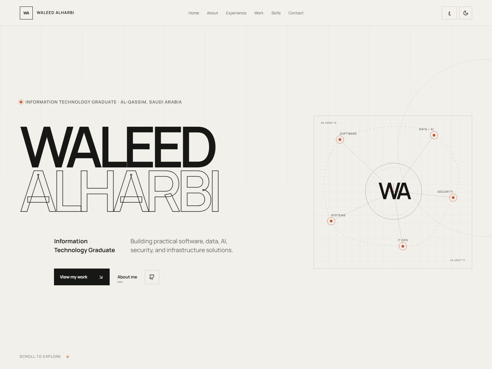
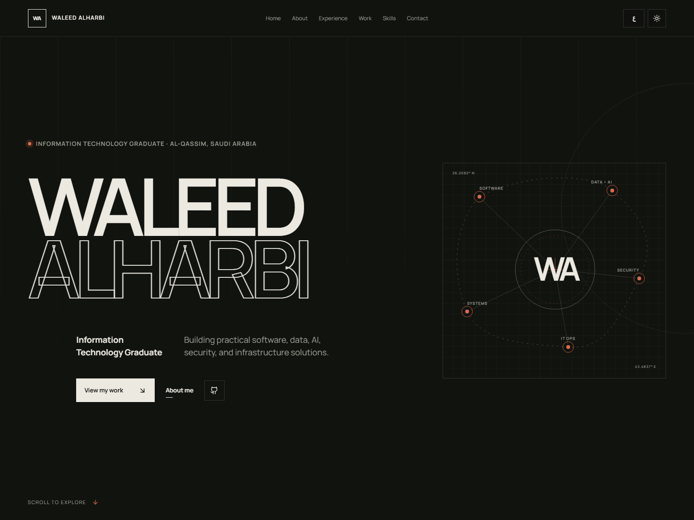
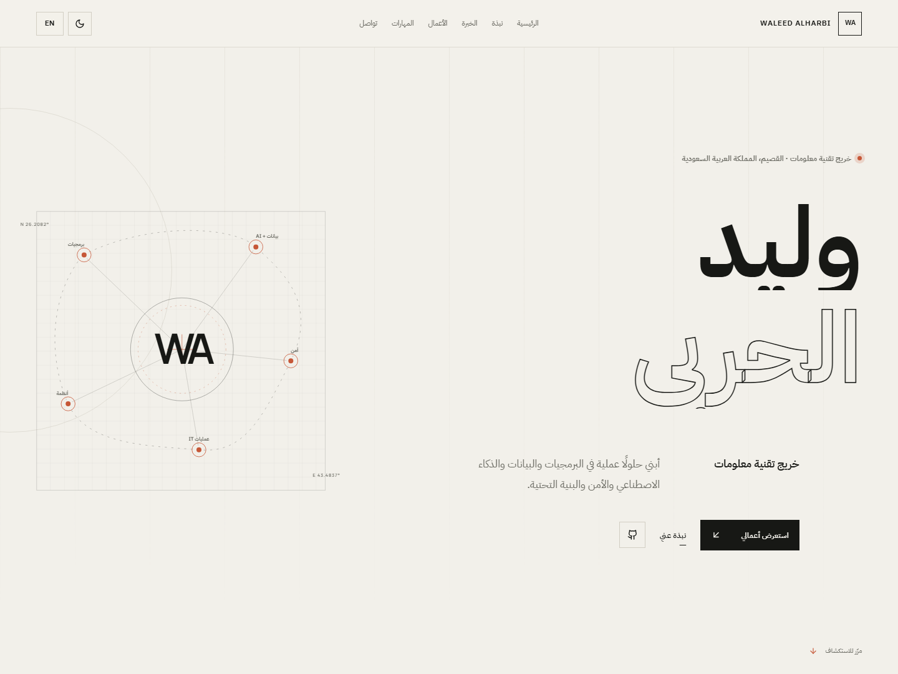
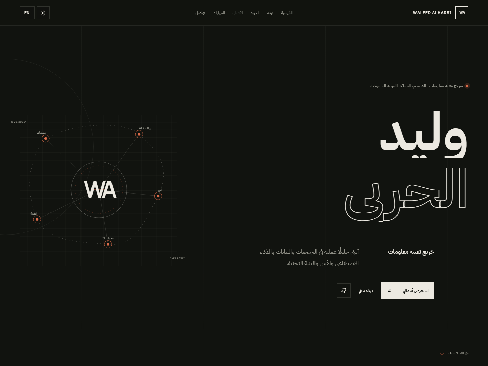

# Waleed Alharbi — Information Technology Portfolio

A bilingual, editorial personal portfolio for Waleed Alharbi, an Information Technology graduate based in Al-Qassim, Saudi Arabia. The site connects five practical specializations through substantial, working projects rather than presenting them as unrelated interests.

## Design direction

The visual system combines desert modernism with technical blueprint notation: warm mineral surfaces, graphite typography, oxide accents, disciplined grid lines, large real project imagery, and an original `WA` technical constellation. It takes inspiration from the restraint and storytelling quality of Rayan Altawijari's portfolio while using an entirely different layout, palette, identity graphic, navigation system, and project structure.

Typography is self-hosted through npm:

- **Manrope Variable** for English: geometric, clear, and strong at oversized editorial scales.
- **IBM Plex Sans Arabic** for Arabic: open-source, professional, highly readable, and designed to hold its quality across interface and display sizes.

## Core experience

- Curated English and Arabic content with instant LTR/RTL switching
- Purpose-built light and dark themes with persisted preferences
- Responsive editorial homepage with refined mobile navigation
- Education, Smart Methods technical training, 1st-place Innovation Hackathon achievement, and graduation research
- Contextual skill mapping instead of logo-based skill clouds
- Accessible motion with `prefers-reduced-motion` support
- Semantic structure, keyboard focus states, localized metadata, and deployment route fallbacks

## Case studies

- IT Helpdesk & Asset Management System
- SOC Security Monitoring Dashboard
- WaqtTech | وقتك
- BASIRA | بصيرة
- BUNYA | بُنية

Every case study uses screenshots copied from the real source project and factual content verified against its README, manifests, source structure, and Git remote.

## Technology stack

React 18 · TypeScript · Vite · React Router · Framer Motion · Lucide React · custom CSS

## Local setup

```powershell
npm install
npm run dev
```

Open `http://127.0.0.1:5173`.

## Production build

```powershell
npm run typecheck
npm run build
npm run preview
```

Client-side route fallbacks are included for Vercel and Netlify-compatible static hosting.

## Screenshots

| English · Light | English · Dark |
| --- | --- |
|  |  |

| Arabic · Light | Arabic · Dark |
| --- | --- |
|  |  |

Additional captures: [Selected Work](screenshots/selected-work.png) · [BUNYA case study](screenshots/case-study.png) · [Arabic mobile](screenshots/mobile.png) · [Arabic mobile menu](screenshots/mobile-menu.png) · [Full homepage](screenshots/full-home.png)

## Deployment

Live site: [waleed-alharbi.github.io/waleed-alharbi-portfolio](https://waleed-alharbi.github.io/waleed-alharbi-portfolio/)

GitHub Pages deploys the production build automatically from `main`. The workflow sets the repository base path, publishes the `dist` artifact, and includes an SPA fallback so direct case-study URLs remain available on refresh. A future custom domain can be connected without changing the application architecture.

## Author

**Waleed Alharbi**  
Information Technology Graduate · Saudi Arabia  
[github.com/Waleed-Alharbi](https://github.com/Waleed-Alharbi)
